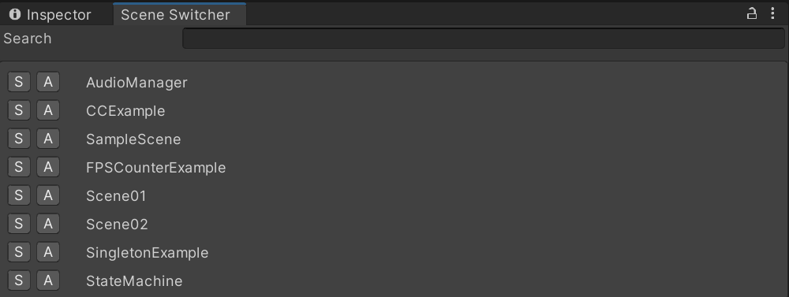

# Scene-Switcher
An editor plugin tool for Unity that shows all of your scenes in one place for easy switching within your project. Can load a single scene or additively. Also comes with a search bar to easily find that one scene you are looking for.



## How to install
This package can be installed through the Unity `Package Manager` with Unity version 2019.3 or greater.

Open up the package manager `Window/Package Manager` and click on `Add package from git URL...`.


Paste in this repository's url.

`https://github.com/Jason-Skillman/Scene-Switcher.git`


Click `Add` and the package will be installed in your project.

---
**NOTE:** For Unity version 2019.2 or lower

If you are using Unity 2019.2 or lower than you will not be able to install the package with the above method. Here are a few other ways to install the package.
1. You can clone this git repository into your project's `Packages` folder.
1. Another alternative would be to download this package from GitHub as a zip file. Unzip and in the `Package Manager` click on `Add package from disk...` and select the package's root folder.

---

### Git submodule
Alternatively you can also install this package as a git submodule.

```console
$ git submodule add https://github.com/Jason-Skillman/Scene-Switcher.git Packages/Scene-Switcher
```

## Editor window
The scene switcher window can be opened by navigating to `Window/Scene Switcher`

1. `S` Opens a single scene.
1. `A` Opens a scene additivly.

The search bar can be used to filter out which scenes are shown.
